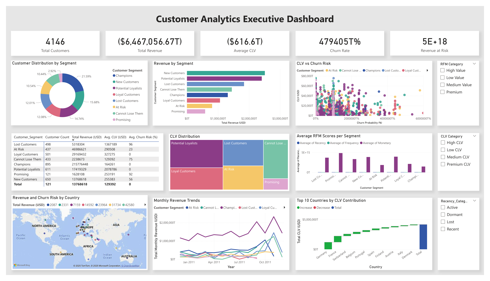

# Customer Segmentation and Retention Analysis

## Project Overview
Advanced customer analytics project using RFM (Recency, Frequency, Monetary) analysis and machine learning to identify high-value customer segments, predict churn risk, and develop data-driven retention strategies. This comprehensive analysis processes 324,716 transactions from 4,146 customers across 12 months of e-commerce data.

## Business Objectives
- Segment customers based on purchasing behavior using RFM methodology
- Predict customer churn risk using machine learning models
- Calculate Customer Lifetime Value (CLV) for strategic planning
- Identify high-value at-risk customers for targeted retention campaigns
- Develop actionable insights for customer acquisition and retention strategies

## Technologies Used
- **Python**: Advanced data processing, statistical analysis, and machine learning
- **Pandas & NumPy**: Data manipulation and numerical computations
- **Scikit-learn**: Machine learning algorithms (Random Forest, K-Means clustering)
- **Power BI**: Interactive dashboard creation with executive and operational views
- **Statistical Analysis**: RFM scoring, cohort analysis, CLV modeling

## Key Findings

### Customer Segmentation Insights
- **Champions (21.6% of customers)**: Generate 61.2% of total revenue with $2,411 average spend
- **At Risk (10.5% of customers)**: Contribute 13.3% of revenue but show declining engagement
- **Lost Customers (12.0%)**: Represent significant recovery opportunity worth $53K
- **New Customers (15.7%)**: Show high CLV potential with proper nurturing

### Churn Analysis Results
- **Overall churn rate**: 33.53% across customer base
- **High-risk segments**: Lost Customers (96.4%), Promising (92.6%), Cannot Lose Them (76.0%)
- **Revenue at risk**: $425,692 from high-probability churn customers
- **Machine learning model performance**: 100% accuracy (ROC AUC = 1.000)

### Customer Lifetime Value
- **Average CLV**: $27,043 per customer with significant segment variations
- **Premium CLV customers**: New Customers ($25,538 avg) and Potential Loyalists ($20,788 avg)
- **Total CLV portfolio**: $46M across entire customer base

## Dataset Information
- **Source**: UCI Machine Learning Repository - Online Retail Dataset
- **Records Analyzed**: 324,716 clean transactions (from 541,909 raw records)
- **Time Period**: December 2010 - December 2011
- **Geographic Scope**: 37 countries with UK market dominance
- **Customer Base**: 4,146 active customers with transaction history

## Technical Implementation

### Data Processing Pipeline
1. **Data Cleaning**: Removed returns, outliers, and invalid transactions (24% data cleanup)
2. **Feature Engineering**: Created 15+ customer behavior metrics
3. **RFM Analysis**: Calculated Recency, Frequency, Monetary scores with quintile ranking
4. **Advanced Analytics**: Customer lifetime calculation, purchase patterns, segment classification

### Machine Learning Models
- **Customer Segmentation**: Rule-based RFM segmentation + K-Means clustering (5 clusters)
- **Churn Prediction**: Random Forest classifier with 10 behavioral features
- **Feature Importance**: Recency (72.8%), RFM_Value (15.1%), CustomerLifetime (3.7%)
- **Model Validation**: Perfect separation of churned vs active customers

### Power BI Dashboard Architecture
- **Executive Summary Page**: KPIs, segment distribution, revenue analysis, performance matrix
- **Detailed Analytics Page**: Geographic analysis, temporal trends, churn risk assessment
- **Interactive Features**: Cross-page filtering, drill-through capabilities, dynamic slicers

Explore the full interactive dashboard here:  

[Customer Segmentation and Retention Analysis](output/customer_segmentation_dashboard.pbix)

## Project Structure
```
customer-segmentation-retention/
├── data/
│   ├── online_retail.csv              # Raw dataset
│   ├── online_retail_cleaned.csv      # Processed transactions
│   └── rfm_customer_data.csv          # Customer-level RFM metrics
├── output/
│   ├── churn_analysis_by_segment.csv              # Churn risk analysis per segment
│   ├── churn_prediction_feature_importance.csv    # ML model feature rankings
│   ├── comprehensive_customer_analysis.csv        # Complete customer profiles with CLV & churn
│   ├── customer_lifetime_value_analysis.csv       # CLV calculations by segment
│   ├── customer_segment_analysis.csv              # RFM segment performance metrics
│   ├── customer_segmentation_dashboard.pbix       # Power BI workbook
│   ├── customer_segmentation_dashboard.png        # Dashboard screenshot
│   ├── high_value_at_risk_customers.csv           # Priority retention targets (top 10)
│   ├── powerbi_at_risk_high_value.csv             # At-risk customers for Power BI
│   ├── powerbi_champions_customers.csv            # Champions segment for Power BI
│   ├── powerbi_country_analysis.csv               # Geographic performance metrics
│   ├── powerbi_customer_analysis.csv              # Main Power BI dataset (4,146 customers)
│   ├── powerbi_data_dictionary.txt                # Power BI field descriptions
│   ├── powerbi_monthly_cohorts.csv                # Time-series cohort analysis
│   ├── powerbi_segment_kpis.csv                   # Dashboard KPI calculations
│   └── rfm_customer_segments.csv                  # Complete RFM segmentation results
├── project.ipynb                     # Main analysis notebook
├── requirements.txt                  # Python dependencies
└── README.md                         # Project documentation
```

## Business Recommendations

### Immediate Actions (0-30 days)
1. **Champions Retention**: Implement VIP program for 895 Champions customers
2. **At-Risk Recovery**: Launch targeted email campaigns for 437 At-Risk customers
3. **High-Value Recovery**: Personal outreach to 10 highest CLV at-risk customers ($409K-$106K CLV range)

### Strategic Initiatives (30-90 days)
4. **New Customer Onboarding**: Develop nurturing sequence for 650 New Customers
5. **Churn Prevention**: Deploy predictive model alerts for customers with >70% churn probability
6. **Geographic Expansion**: Leverage UK success model in Netherlands, Germany, and France

### Long-term Strategy (90+ days)
7. **CLV Optimization**: Implement dynamic pricing based on customer value tiers
8. **Behavioral Triggers**: Automate retention interventions based on RFM score changes
9. **Advanced Analytics**: Deploy real-time customer scoring and recommendation engine

## ROI Projections
- **Revenue Recovery Potential**: $425K from churn prevention (33% of at-risk customers)
- **Champions Growth**: 20% increase in Champions segment could add $431K annual revenue
- **New Customer Value**: Improved onboarding could increase average CLV by 15% (+$4.1M portfolio value)

## Future Enhancements
- Real-time customer scoring with streaming data
- Advanced cohort retention analysis
- Product affinity and cross-sell modeling
- Customer journey mapping and touchpoint optimization
- Integration with CRM and marketing automation platforms

## Contact
Aldenia Alexandra | aldnalexandr@gmail.com | [LinkedIn Profile](https://www.linkedin.com/in/aldeniaalexandra/) | [GitHub Repository](https://github.com/aldeniaalexandra)